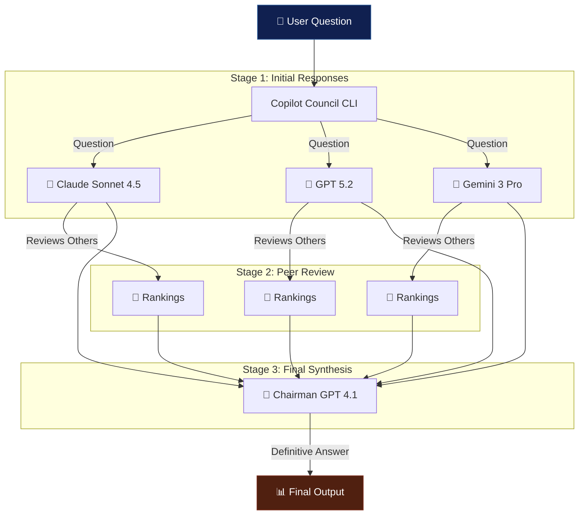

# Copilot Council

[](https://github.com/openjny/copilot-council/actions/workflows/ci.yml)
[](https://github.com/openjny/copilot-council/actions/workflows/release.yml)
[](https://github.com/openjny/copilot-council/releases/latest)
[](https://goreportcard.com/report/github.com/openjny/copilot-council)
[](https://opensource.org/licenses/MIT)

Copilot Council is a CLI tool that implements the [LLM Council](https://github.com/karpathy/llm-council) pattern using the [GitHub Copilot CLI SDK](https://github.com/github/copilot-sdk). It uses a **3-stage process**: multiple AI models answer a question, then peer-review each other's responses, and finally a Chairman model synthesizes the best answer based on all responses and reviews.

## How it Works

The Council Pattern uses a democratic approach with three stages:

### Stage 1: Initial Responses

Multiple AI models independently answer your question in parallel.

### Stage 2: Peer Review

Each model reviews and ranks the other models' responses (anonymized to ensure fairness).

### Stage 3: Final Synthesis

The Chairman model analyzes all responses AND peer reviews to produce a definitive, well-reasoned answer.



## Features

- 🤖 **Multiple AI Models**: Consult Claude, GPT, and Gemini simultaneously
- ⚡ **Parallel Execution**: Fast responses through concurrent processing
- 📝 **Peer Review**: Models critique and rank each other's answers
- 🎯 **Smart Aggregation**: Chairman synthesizes the best answer using all evidence
- 💡 **Decisive Answers**: Designed to avoid vague "it depends" responses
- 🎨 **Beautiful Output**: Color-coded, easy-to-read terminal output with progress indicators
- ⚙️ **Customizable**: Choose your own models and aggregator
- 🔄 **Real-time Progress**: Live spinner animations and timing information
- 📊 **Detailed Summary**: Performance metrics and success rates

## Prerequisites

- [GitHub Copilot CLI](https://github.com/github/copilot-cli)
- Active GitHub Copilot subscription

## Installation

### Homebrew (macOS/Linux)

```bash
brew tap openjny/tap
brew install copilot-council
```

### Linux

```bash
wget https://github.com/openjny/copilot-council/releases/latest/download/copilot-council_linux_amd64.tar.gz
tar -xzf copilot-council_linux_amd64.tar.gz
sudo mv copilot-council /usr/local/bin/
```

### Windows

Download `copilot-council_windows_amd64.zip` from releases.

### Build From Source

```bash
git clone https://github.com/openjny/copilot-council.git
cd copilot-council
go build -o copilot-council ./cmd/copilot-council
```

## Usage

```bash
# Basic
copilot-council "What is the capital of France?"

# Custom models
copilot-council --models claude-sonnet-4.5,gpt-5.2 "Explain quantum computing"

# Different aggregator
copilot-council --aggregator gpt-5.2 "Best practices for Go"

# Verbose mode
copilot-council --verbose "Complex question"

# Adjust timeout
copilot-council --timeout 120 "Long question"
```

### Example Output

```
╭────────────────────────────────────────────────────────╮
│          🏛️  Council - AI Model Council               │
╰────────────────────────────────────────────────────────╯

❓ Question: What is quantum entanglement?

╔════════════════════════════════════════════════════════╗
║ 🔄 Querying models in parallel...                     ║
╚════════════════════════════════════════════════════════╝

  [✓] claude-sonnet-4.5         ⏱️  4.2s
  [✓] gpt-5.2                   ⏱️  3.8s
  [✓] gemini-3-pro-preview      ⏱️  5.1s

╔════════════════════════════════════════════════════════╗
║ 📝 Conducting peer review...                          ║
╚════════════════════════════════════════════════════════╝

  [✓] claude-sonnet-4.5 (review) ⏱️  2.3s
  [✓] gpt-5.2 (review)           ⏱️  2.1s
  [✓] gemini-3-pro-preview (review) ⏱️  2.5s

  [✓] Peer review complete: 3 models reviewed each other (6.9s)

╔════════════════════════════════════════════════════════╗
║ 🔄 Synthesizing responses...                          ║
╚════════════════════════════════════════════════════════╝

  [✓] Synthesis complete (2.8s)

╭────────────────────────────────────────────────────────╮
│ ⭐ FINAL ANSWER                                        │
╰────────────────────────────────────────────────────────╯

Quantum entanglement is a phenomenon where two or more particles
become correlated in such a way that the quantum state of one
particle cannot be described independently of the others...

╭────────────────────────────────────────────────────────╮
│ 📊 EXECUTION SUMMARY                                   │
├────────────────────────────────────────────────────────┤
│                                                        │
│ Stage 1: Initial Responses                             │
│   Models queried:    3/3 successful                    │
│   Fastest:           gpt-5.2 (3.8s)                    │
│   Phase time:        5.1s                              │
│                                                        │
│ Stage 2: Peer Review                                   │
│   Reviews completed: 3/3 successful                    │
│   Phase time:        6.9s                              │
│                                                        │
│ Stage 3: Final Synthesis                               │
│   Phase time:        2.8s                              │
│                                                        │
├────────────────────────────────────────────────────────┤
│ Total execution time: 14.8s                            │
╰────────────────────────────────────────────────────────╯
```

Note: Use `--verbose` flag to see individual model responses and detailed peer review results.

## Options

| Option                | Default                                          | Description                                |
| --------------------- | ------------------------------------------------ | ------------------------------------------ |
| `--models` / `-m`     | `claude-sonnet-4.5,gpt-5.2,gemini-3-pro-preview` | Models to consult                          |
| `--aggregator` / `-a` | `gpt-4.1`                                        | Chairman model for final synthesis         |
| `--timeout` / `-t`    | `60`                                             | Timeout (seconds) per model request        |
| `--verbose` / `-v`    | `false`                                          | Show individual responses and peer reviews |

## Available Models

- `claude-sonnet-4.5`
- `claude-haiku-4.5`
- `claude-opus-4.5`
- `claude-sonnet-4`
- `gpt-5.2`
- `gpt-5.2-codex`
- `gpt-5.1-codex-max`
- `gpt-5.1-codex`
- `gpt-5.1`
- `gpt-5`
- `gpt-5.1-codex-mini`
- `gpt-5-mini`
- `gpt-4.1`
- `gemini-3-pro-preview`

You can look up the latest available models via `copilot --help`.

## License

MIT License - See [LICENSE](LICENSE)
