# Copilot Council

[](https://github.com/openjny/copilot-council/actions/workflows/ci.yml)
[](https://github.com/openjny/copilot-council/actions/workflows/release.yml)
[](https://github.com/openjny/copilot-council/releases/latest)
[](https://goreportcard.com/report/github.com/openjny/copilot-council)
[](https://opensource.org/licenses/MIT)

Copilot Council is a CLI tool that implements the [LLM Council](https://github.com/karpathy/llm-council) using the [GitHub Copilot CLI SDK](https://github.com/github/copilot-sdk). It asks the same question to multiple AI models (Claude, GPT, Gemini) in parallel, then aggregates their responses to produce a final synthesized answer.

## How it Works

```mermaid
graph TB
    User[👤 User Question] --> Council[Copilot Council CLI]
    Council -->|Question| Claude["🤖 Council Model<br/>(Claude Sonnet 4.5\)"]
    Council -->|Question| GPT["🤖 Council Model<br/>(GPT 5.2)"]
    Council -->|Question| Gemini["🤖 Council Model<br/>(Gemini 3 Pro)"]

    Claude -->|Answer| Aggregator["🎯 Chairman Model<br/>(GPT 4.1)"]
    GPT -->|Answer| Aggregator
    Gemini -->|Answer| Aggregator

    Aggregator -->|Aggregated Answer| Output[📊 Final Output]

    style User fill:#102050,stroke:#2d5f9e,color:#fff
    style Output fill:#502010,stroke:#803020,color:#fff
```



## Features

- 🤖 **Multiple AI Models**: Consult Claude, GPT, and Gemini simultaneously
- ⚡ **Parallel Execution**: Fast responses through concurrent processing
- 🎯 **Smart Aggregation**: Synthesize the best answer from all models
- 🎨 **Beautiful Output**: Color-coded, easy-to-read terminal output with progress indicators
- ⚙️ **Customizable**: Choose your own models and aggregator
- 🔄 **Real-time Progress**: Live spinner animations and timing information
- 📊 **Detailed Summary**: Performance metrics and success rates

## Prerequisites

- [GitHub Copilot CLI](https://github.com/github/copilot-cli)
- Active GitHub Copilot subscription

## Installation

### Homebrew (macOS/Linux)

```bash
brew tap openjny/tap
brew install copilot-council
```

### Binary Releases

Download from the [releases page](https://github.com/openjny/copilot-council/releases).

#### Linux

```bash
# Download and extract
wget https://github.com/openjny/copilot-council/releases/latest/download/copilot-council_linux_amd64.tar.gz
tar -xzf copilot-council_linux_amd64.tar.gz

# Install (requires sudo)
sudo mv copilot-council /usr/local/bin/

# Or install to user directory (no sudo required)
mkdir -p ~/.local/bin
mv copilot-council ~/.local/bin/
# Add ~/.local/bin to PATH if not already
```

#### Windows

Download `copilot-council_windows_amd64.zip` from releases.

### From Source

```bash
git clone https://github.com/openjny/copilot-council.git
cd copilot-council
go build -o copilot-council ./cmd/copilot-council
```

## Usage

```bash
# Basic
copilot-council "What is the capital of France?"

# Custom models
copilot-council --models claude-sonnet-4.5,gpt-5.2 "Explain quantum computing"

# Different aggregator
copilot-council --aggregator gpt-5.2 "Best practices for Go"

# Verbose mode
copilot-council --verbose "Complex question"

# Adjust timeout
copilot-council --timeout 120 "Long question"
```

### Example Output

```
╭────────────────────────────────────────────────────────╮
│          🏛️  Council - AI Model Council               │
╰────────────────────────────────────────────────────────╯

❓ Question: What is quantum entanglement?

🔄 Querying models in parallel...

  [✓] claude-sonnet-4.5         ⏱️  4.2s
  [✓] gpt-5.2                   ⏱️  3.8s
  [✓] gemini-3-pro-preview      ⏱️  5.1s

╭────────────────────────────────────────────────────────╮
│ 🔄 Synthesizing responses...                          │
╰────────────────────────────────────────────────────────╯
  [✓] Synthesis complete (2.1s)

╭────────────────────────────────────────────────────────╮
│ ⭐ FINAL ANSWER                                        │
╰────────────────────────────────────────────────────────╯

Quantum entanglement is a phenomenon where two or more particles
become correlated in such a way that the quantum state of one
particle cannot be described independently of the others...

╭────────────────────────────────────────────────────────╮
│ 📊 EXECUTION SUMMARY                                   │
├────────────────────────────────────────────────────────┤
│ Models queried:  3/3 successful                        │
│ Fastest model:   gpt-5.2 (3.8s)                        │
│ Total time:      7.4s                                  │
│ Parallel speedup: ~1.8x                                │
╰────────────────────────────────────────────────────────╯
```

## Options

| Option                | Default                                          | Description       |
| --------------------- | ------------------------------------------------ | ----------------- |
| `--models` / `-m`     | `claude-sonnet-4.5,gpt-5.2,gemini-3-pro-preview` | Models to consult |
| `--aggregator` / `-a` | `gpt-4.1`                                        | Aggregation model |
| `--timeout` / `-t`    | `60`                                             | Timeout (seconds) |
| `--verbose` / `-v`    | `false`                                          | Verbose output    |

## Available Models

- `claude-sonnet-4.5`
- `claude-haiku-4.5`
- `claude-opus-4.5`
- `claude-sonnet-4`
- `gpt-5.2`
- `gpt-5.2-codex`
- `gpt-5.1-codex-max`
- `gpt-5.1-codex`
- `gpt-5.1`
- `gpt-5`
- `gpt-5.1-codex-mini`
- `gpt-5-mini`
- `gpt-4.1`
- `gemini-3-pro-preview`

You can look up the latest available models via `copilot --help`.

## License

MIT License - See [LICENSE](LICENSE)
